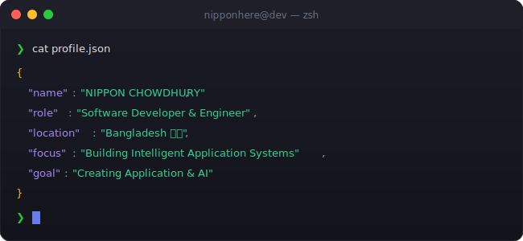

<!-- 
╔═══════════════════════════════════════════════════════════╗
║                                                           ║
║    ███╗   ██╗██╗██████╗ ██████╗  ██████╗ ███╗   ██╗       ║
║    ████╗  ██║██║██╔══██╗██╔══██╗██╔═══██╗████╗  ██║       ║
║    ██╔██╗ ██║██║██████╔╝██████╔╝██║   ██║██╔██╗ ██║       ║
║    ██║╚██╗██║██║██╔═══╝ ██╔═══╝ ██║   ██║██║╚██╗██║       ║
║    ██║ ╚████║██║██║     ██║     ╚██████╔╝██║ ╚████║       ║
║    ╚═╝  ╚═══╝╚═╝╚═╝     ╚═╝      ╚═════╝ ╚═╝  ╚═══╝       ║
║                                                           ║
║  🚀 SOFTWARE DEVELOPER • ENGINEER • PROBLEM SOLVER 🚀    ║
║                                                           ║
╚═══════════════════════════════════════════════════════════╝

-->

<div align="center">
  
  <!-- ═══════════════════════════════════════════════════════════════════════════ -->
  <!-- 🎯 ANIMATED HEADER                                                          -->
  <!-- ═══════════════════════════════════════════════════════════════════════════ -->
  
  
  
  <br/>
  
  <!-- ═══════════════════════════════════════════════════════════════════════════ -->
  <!-- 📊 PROFILE BADGES                                                           -->
  <!-- ═══════════════════════════════════════════════════════════════════════════ -->
  
  <a href="https://github.com/iamnippon">
    
  </a>
  &nbsp;
  <a href="https://github.com/iamnippon?tab=repositories">
    
  </a>
  &nbsp;
  <a href="https://github.com/iamnippon?tab=followers">
    
  </a>
  &nbsp;
  <a href="https://github.com/iamnippon">
    
  </a>
  
</div>

<br/>

<!-- ═══════════════════════════════════════════════════════════════════════════ -->
<!-- 🖥️ TERMINAL INTRO SECTION                                                   -->
<!-- ═══════════════════════════════════════════════════════════════════════════ -->

<div align="center">
  
</div>

<br/>


<br/>

<!-- ═══════════════════════════════════════════════════════════════════════════ -->
<!-- 👤 ABOUT ME SECTION                                                          -->
<!-- ═══════════════════════════════════════════════════════════════════════════ -->


<br/><br/>

<table>
<tr>
<td width="55%" valign="top">

### 🎯 What I Do

```yaml
name: Nippon Chowdhury
located_in: Bangladesh 🇧🇩
current_status: Did My B.Sc. in CS & Self-Taught Developer

areas_of_expertise:
  - 📱  Android Studio (Android Application)
  - 🍎 Xcode (IOS Application)
  - 🤖 AI & Machine Learning
  - 🐍 Python Development
  - 💬 Chatbot Architecture
  - 🌐 Full-Stack Web Development
  - 🧠 Deep Learning & NLP

currently_building:
  - Developer Productivity Apps
  - Next-gen Conversational AI Agents
  - JARVIS-like Personal Assistant
  

life_philosophy: "Code defines the rules. AI explores beyond them."
```

</td>
<td width="45%" valign="top">

### 🚀 Current Focus

- 🔬 **Research & Build** advanced Mobile systems
- 🤖 **Developing** intelligent chatbots
- 🧠 **Exploring** LLMs & transformers
- 🌟 **Contributing** to open-source
- 📚 **Mentoring** aspiring developers

<br/>

### 💡 Quick Facts

- 🎓 Competitive programming mindset
- 🔥 Passionate about automation
- 🌱 Always learning new technologies
- ☕ Fueled by coffee & curiosity

</td>
</tr>
</table>

<br/>


<br/>

<!-- ═══════════════════════════════════════════════════════════════════════════ -->
<!-- 🏆 ACHIEVEMENTS SECTION                                                     -->
<!-- ═══════════════════════════════════════════════════════════════════════════ -->


<br/><br/>

<div align="center">
  
  <!-- GitHub Trophies -->
  <a href="https://github.com/ryo-ma/github-profile-trophy">
    
  </a>
  
</div>

<br/>


<!-- ═══════════════════════════════════════════════════════════════════════════ -->
<!-- 📝 END OF README                                                            -->
<!-- ═══════════════════════════════════════════════════════════════════════════ -->
